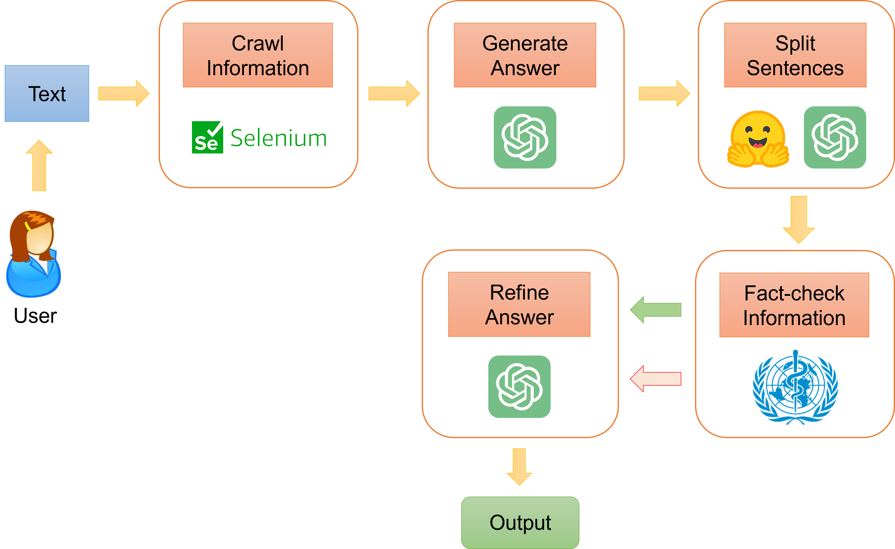
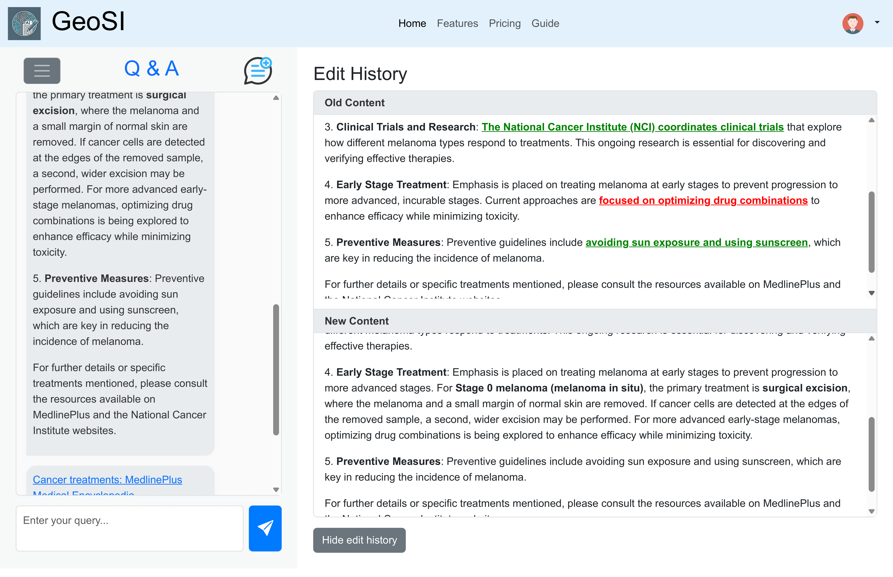

# SCID 2025

# Title

Enhancing Medical Chatbot Reliability: A Multi-Step Verification Approach to Prevent Hallucinations

# Authors

| No. | Author                        | Email                         |
| --- | ----------------------------- | ----------------------------- |
| 1   | Trong-Nghia Tran<sup>\*</sup> | 21120507@student.hcmus.edu.vn |
| 2   | Minh-Nhat Nguyen<sup>\*</sup> | 21120107@student.hcmus.edu.vn |
| 3   | Minh-Triet Tran               | tmtriet@fit.hcmus.edu.vn      |
| 4   | Trong-Le Do<sup>\*\*</sup>    | dtle@selab.hcmus.edu.vn       |

_<sup>_</sup>\_ Both authors contribute equally.

_<sup>\*_</sup>\_ Corresponding author

## Introduction

Medical chatbots powered by large language models (LLMs) have shown significant potential in providing healthcare-related information. However, ensuring the reliability of chatbot-generated responses is crucial to preventing misinformation and hallucinated outputs.

This project introduces a **multi-step verification framework** to enhance chatbot reliability by integrating fact-checking mechanisms. The system is designed to retrieve medical information dynamically, verify accuracy using authoritative sources like WHO, and refine responses to ensure credibility.

# Workflow

<center>
  
  <figcaption>Overall Workflow</figcaption>
</center>

# Features

- **Real-time Information Retrieval**: Uses Selenium and Bing Search to fetch the latest medical articles.
- **Fact-Checking Mechanism**: Verifies chatbot responses by cross-referencing with WHO data and Medical-NER models.
- **Multi-Step Verification**:
  1. Crawling medical data and generating answers.
  2. Splitting sentences for precise verification.
  3. Fact-checking and correcting hallucinated responses.
  4. Refining the final output to ensure clarity and coherence.
- **Visualization & User Interaction**: Provides interactive features for users to explore real-time medical data on a world map.
- **Benchmark Testing**: Evaluated on the **COVID-Fact dataset**, achieving **79.5% accuracy** in fact verification.

# Testing pipeline

Please refer to this [Colab link](https://colab.research.google.com/drive/1OAZnnOEv-c1TwcFCyPINHuO2BYvnb6-Q?usp=sharing) to run a test of the system's pipeline.

## Example Query & Response

**User Query:** "Effective treatments for cancer on MedlinePlus"

**AI-generated Answer:**

> "...treating melanoma at early stages to prevent progression to more advanced, incurable stages. Current approaches are **focused on optimizing drug combinations** to enhance efficacy while minimizing toxicity..."

**Refined Response:**

> "...treating melanoma at early stages to prevent progression to more advanced stages. **For Stage 0 melanoma (melanoma in situ), the primary treatment is surgical excision, where the melanoma and a small margin of normal skin are removed**..."

**Sources:** [Treatment of Melanoma Skin Cancer, by Stage](https://www.cancer.org/cancer/types/melanoma-skin-cancer/treating/by-stage.html)

<center>

</center>

# Compare to other chat-bots

We compare this with responses from two popular medical chat-bots: ChatGPT and Claude

**User Query:** "Antibodies in infants born to mothers with COVID-
19 pneumonia"

## [ChatGPT (OpenAI)](https://chatgpt.com/share/68241eb3-9bfc-800f-b6b9-ebaa62448358)

Mostly accurate immunological explanation, but includes speculative and unsupported generalizations.

<center>

</center>

### Response:

> "Several studies have shown that infants born to mothers with COVID-19... had detectable levels of anti-SARS-CoV-2 IgG antibodies at birth." **[Uncited generalization]**

> "If infection occurs several weeks before delivery..." **[Speculative timing effect not demonstrated]**

> "False positives [for IgM] can occur." **[No source or evidence provided]**

> "Most studies report that neonatal SARS-CoV-2 infection is uncommon..." **[Overgeneralization not supported by current paper]**

### Assessment:

Accurate in describing known mechanisms like IgG/IgM transfer, but the answer extrapolates beyond the data in the source paper, citing trends and results that are not backed by the specific study or documented with references.

## [Claude (Anthropic)](https://claude.ai/share/b4f09180-c82f-45d5-8bc2-7c97b123b737)

Comprehensive but contains speculative or unsupported claims without citation.

<center>

</center>

### Response:

> "Most pregnant women who develop COVID-19 pneumonia
> produce detectable anti-SARS-CoV-2 antibodies" \*\*[Unsup-
>
> > ported generalization]\*\*

> "These antibodies are frequently detected in cord blood of their newborns" **[Cord blood not measured]**

> "The concentration of antibodies in newborns often corre-
> lates with maternal antibody levels" **[No correlation analysis]**

> "In some cases, infants can have higher concentrations of
> these antibodies than their mothers" **[No supporting data]**

### Assessment:

While the explanation of IgG transfer is accurate and aligns with existing immunological knowledge, key claims about antibody prevalence, cord blood, and comparative levels between mother and infant are not supported by the cited study and therefore risk being hallucinated or misleading without further evidence.

# Evaluation

The chatbot has been tested using the COVID-Fact dataset, comparing its performance against baseline models. Results indicate a 79.5% accuracy in filtering out misinformation.

# Citation

If you use this work in your research, please cite:

```
@inproceedings{Tran2025SCID,
  author = {Trong-Nghia Tran, Minh-Nhat Nguyen, Trong-Le Do, Minh-Triet Tran},
  title = {Enhancing Medical Chatbot Reliability: A Multi-Step Verification Approach to Prevent Hallucinations},
  booktitle = {SCID 2025},
  year = {2025},
}
```
